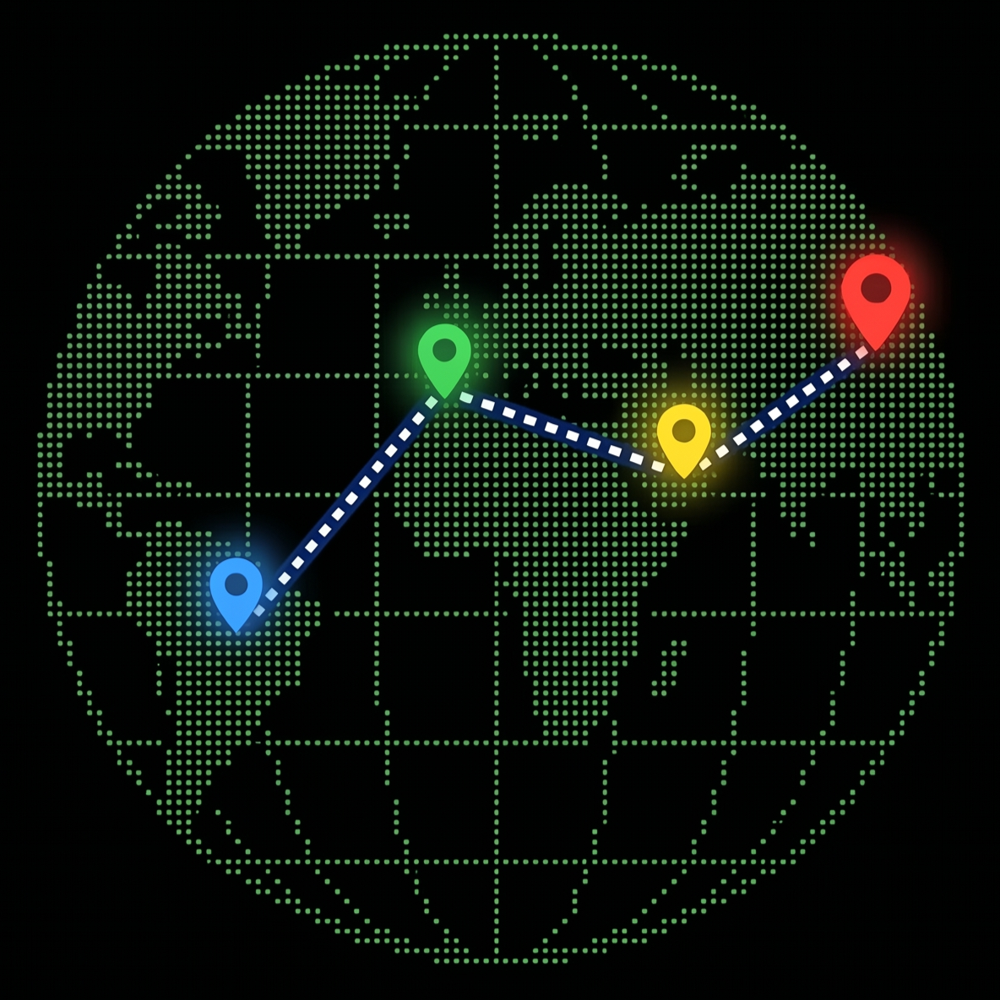
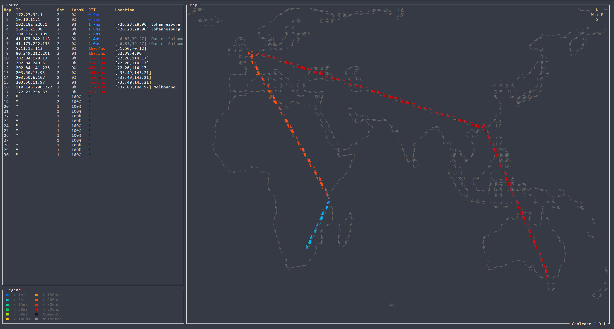

<p align="center">
  
</p>

# GeoTrace

**A geographical `mtr` clone with a Braille-rendered world map in the terminal.**

[](https://github.com/Umlatt/development/stargazers)
[](https://github.com/Umlatt/development/network/members)
[](https://github.com/Umlatt/development/issues)
[](https://github.com/Umlatt/development/pulls)
[](LICENSE)
[](https://www.rust-lang.org/)

---

GeoTrace runs a continuous traceroute (like `mtr`) and plots every hop on a real-time world map rendered with Unicode Braille characters directly in your terminal. It combines ICMP probing, GeoIP lookups, and RTT-based location validation into a single, self-contained binary.

## Features

- **Live world map** — coastlines, country borders, and state/province boundaries (10m resolution) drawn with Braille Unicode (2×4 sub-cell resolution per character)
- **Continuous traceroute** — mtr-style probing with per-hop packet loss, sent count, and RTT history
- **GeoIP mapping** — every hop placed on the map using an embedded MaxMind GeoLite2-City database
- **RTT plausibility checking** — detects when GeoIP claims a location further than the speed of light allows; flags suspect hops with gray `@` markers
- **11-tier RTT color scale** — route segments and RTT values are color-coded from deep blue (<1 ms) through green, yellow, orange, to dark red (>300 ms); timeouts shown in black
- **Animated zoom** — starts with a world view, smoothly zooms into the route area after the first trace completes
- **Interactive navigation** — zoom in/out with `+`/`-`, pan with arrow keys, reset to home view with Space
- **Help popup** — on-screen control reference shown at startup; dismiss with any key, reopen with `?`
- **Legend panel** — bordered color-reference grid below the route table showing all RTT tiers and the mismatch indicator
- **Anti-aliased rendering** — Wu's line algorithm for smooth map borders; thick lines for route paths
- **Session isolation** — unique ICMP identifiers per session; multiple instances run without interference
- **Zero runtime dependencies** — GeoIP database and geographic data are compiled into the binary

## Screenshot



## Requirements

- **Linux** (raw ICMP sockets via `cap_net_raw`)
- **Rust 1.70+** (tested with 1.95)
- **MaxMind GeoLite2-City.mmdb** — [sign up for a free license key](https://dev.maxmind.com/geoip/geolite2-free-geolocation-data) and download the database
- A terminal with Unicode and 256-color support

## Installation

```bash
# Clone the repository
git clone https://github.com/Umlatt/development.git
cd development/geotrace

# Place the GeoLite2 database
cp /path/to/GeoLite2-City.mmdb data/

# Build (optimized release with LTO)
make build

# Grant raw socket capability (requires sudo)
make setcap
```

## Usage

```bash
# Basic traceroute
./target/release/geotrace 8.8.8.8

# With custom max hops
./target/release/geotrace --max-hops 20 example.com

# Or use the Makefile
make run ARGS="1.1.1.1"
```

### Keyboard Controls

| Key | Action |
|---|---|
| `+` / `=` | Zoom in |
| `-` / `_` | Zoom out |
| `↑` `↓` `←` `→` | Pan the map |
| `Space` | Reset to auto-zoom home view |
| `?` | Toggle help popup |
| `q` / `Esc` | Quit |

### Sidebar Columns

| Column | Description |
|---|---|
| **Hop** | TTL hop number |
| **IP** | Responding IP address |
| **Snt** | Number of probes sent to this hop |
| **Loss%** | Packet loss percentage |
| **RTT** | Round-trip time (11-tier color scale: deep blue → cyan → teal → green → yellow-green → yellow → orange → red-orange → red → dark red; black = timeout) |
| **Location** | Coordinates + city/org from GeoIP |

Gray text in the Location column indicates a **latency/distance mismatch** — GeoIP reports a location further than the RTT physically allows (e.g., anycast IPs like 8.8.8.8 registered in the US but served locally). The IP address remains white.

## Architecture

```
geotrace/
├── Cargo.toml              # Dependencies and build config
├── Makefile                # Build, setcap, run targets
├── LICENSE                 # MIT + third-party notices
├── CHANGELOG.md            # Version history
├── data/
│   ├── GeoLite2-City.mmdb  # MaxMind GeoIP database (not in repo)
│   └── geodata.bin         # Embedded NaturalEarth border data (~1 MB, 10m resolution)
├── scripts/
│   └── fetch_geodata.py    # Downloads & converts NaturalEarth data
└── src/
    ├── main.rs             # Entry point, CLI, TUI event loop, zoom animation
    ├── network.rs          # ICMP traceroute engine, session isolation
    ├── geoip.rs            # MaxMind GeoIP lookups + haversine distance
    ├── geodata.rs           # Binary geodata parser (coastlines, borders)
    └── ui.rs               # Ratatui rendering: sidebar, Braille map, compass
```

### Module Overview

| Module | Responsibility |
|---|---|
| `main.rs` | CLI parsing (clap), terminal setup, async task spawning, 30 FPS render loop with animated zoom, keyboard input handling (zoom, pan, home reset, help toggle) |
| `network.rs` | ICMP echo request/reply via pnet raw sockets, per-session unique identifier (PID ⊕ timestamp), reply filtering for Echo Reply and Time Exceeded packets, continuous mtr-style probing, RTT-based GeoIP plausibility validation |
| `geoip.rs` | MaxMind GeoLite2 reader from embedded bytes, cached IP→location lookups, haversine great-circle distance calculation |
| `geodata.rs` | Parser for compact binary format (45565 polylines, ~108987 points across 3 detail levels), zoom-adaptive detail visibility |
| `ui.rs` | Braille canvas (2×4 dots per cell), Wu's anti-aliased line drawing, equirectangular map projection, hop pin rendering (`@` markers), sidebar route table + legend panel, compass rose, 11-tier RTT color coding, help popup |

### Data Flow

```
┌──────────────┐     mpsc      ┌──────────────┐
│  network.rs  │──────────────▶│   main.rs    │
│  ICMP probes │   HopUpdate   │  state merge │
│  + GeoIP     │               │  + zoom anim │
└──────────────┘               └──────┬───────┘
                                      │
                                      ▼
                               ┌──────────────┐
                               │    ui.rs     │
                               │ Braille map  │
                               │ + sidebar    │
                               └──────────────┘
```

1. `network.rs` sends ICMP probes with incrementing TTL, performs GeoIP lookups and RTT validation, streams `HopUpdate` messages via tokio mpsc channel
2. `main.rs` merges updates into shared `AppState`, drives animated viewport zoom, handles keyboard input
3. `ui.rs` renders the Braille world map with geographic borders, route lines, hop pins, sidebar table, compass, and legend at 30 FPS

## Regenerating Geographic Data

The embedded `data/geodata.bin` is pre-built. To regenerate from source:

```bash
pip install requests
python scripts/fetch_geodata.py
```

This downloads NaturalEarth GeoJSON from GitHub, applies Douglas-Peucker simplification, and outputs the compact binary format.

## Test Targets

| Region | IP | Notes |
|---|---|---|
| South Africa | `196.15.240.40` | Telkom SA |
| Europe (London) | `81.2.69.144` | BBC |
| US (anycast) | `8.8.8.8` | Google DNS — triggers gray mismatch from RSA |
| US (anycast) | `1.1.1.1` | Cloudflare — likely local PoP |
| Brazil | `200.160.2.3` | NIC.br |
| Japan | `210.171.224.1` | IIJ Tokyo |
| Australia | `203.2.218.214` | Telstra Sydney |
| Singapore | `203.116.12.1` | SingTel |

## Acknowledgements

- [MaxMind](https://www.maxmind.com) — GeoLite2 geolocation data (CC BY-SA 4.0)
- [Natural Earth](https://www.naturalearthdata.com) — public domain map data
- [ratatui](https://github.com/ratatui/ratatui) — terminal UI framework
- [pnet](https://github.com/libpnet/libpnet) — raw packet networking

## License

MIT — see [LICENSE](LICENSE) for details.

This product includes GeoLite2 data created by MaxMind, available from [https://www.maxmind.com](https://www.maxmind.com).
